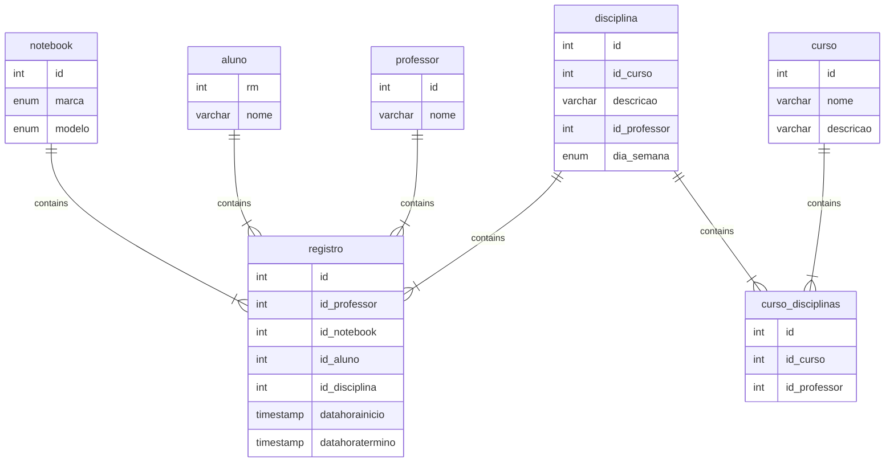

# Controle de Notebooks

Neste projeto iremos criar uma aplicação Web e uma API para o controle de uso dos notebooks da Sala Maker.

## Grupo

Num | Integrantes                        | Tema |
-- |------------------------------------| -- |
1 | Guilerme, Chiara, Thiago Barros    | Locação |

## Entidade Informação

1. Incluir dados institucionais [endereco];
2. Incluir dados de midias sociai;
3. Incluir links de sites associados;

## Entidade de avisos [Mural Digital];
* descrição;
* data inicio;
* data término;
* imagem [];
